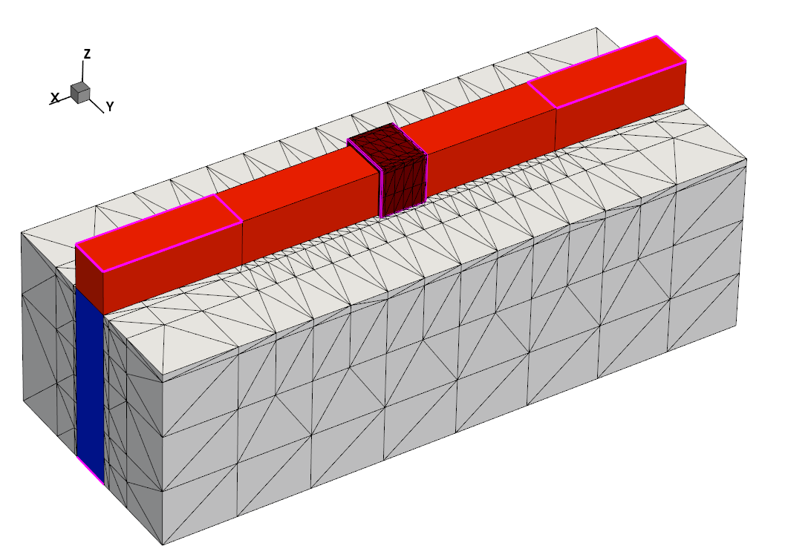

# pytaurus
Repository that provide a wrapper to use the software [Sentaurus TCAD](www.synopsys.com) with Python.  


## Projects

### Basics
Import the library and create an instance
```python
from pytaurus import Project

path = '/path/to/TCAD/project'
project = Project(path)
```

### Running simulations
Running a simple simulation:
```python
exit_code = project.gsub()
print(f'Project run with exit code {exit_code}')
```

It is also possible to choose the nodes to simulate by giving a list of integer:
```python
exit_code = project.gsub(nodes=[1, 2, 3])
print(f'Project ran with exit code {exit_code}')
```

### Cleaning project
```python
exit_code = project.gcleanup()
print(f'Project cleaned with exit code {exit_code}')
```

### Custom environment
When remotely calling subprocess call, it can happen that issue related to the environment variable arise. 

such error include and are not limited to:
```
Job failed
Error: set ISEDB environment variable 
gjob exits with status 1
```

If such error arises, it is possible to manually set needed environment variables for the smooth running of the 
simulation.
```python
from pytaurus import Project

path = '/path/to/TCAD/project'
project = Project(path)

tcad_path = '/usr/synopsys/L_2016/bin'
scl_path = '/usr/synopsys/SCL/linux64/bin'
license_path = '/usr/synopsys/SCL/admin/license/license.dat'
stdb_path = '/home/user/STDB'

project.set_environment(tcad_path=tcad_path, 
                        scl_path=scl_path, 
                        license_path=license_path, 
                        stdb_path=stdb_path)
                        
exit_code = project.gsub()
```
The environment can also be passed directly when creating the instance:
```python
project = Project(path, environment=custom_environment)
```
Or when cleaning or running the project:
```python
gsub_exit_code = project.gsub(environment=custom_environment)
gclean_exit_code = project.gcleanup(environment=custom_environment)
```

**Note:** When calling subprocess, the argument `shell` is set to `True`. It does implicate [security considerations](https://docs.python.org/3/library/subprocess.html#security-considerations)
even if this argument is needed for running simulation (When `shell` is set to `False`, there are issues with environment variables, moreover, it is impossible to use a custom environment if the shell is not invoked)

## PLT Files
This repository contains a very simple class to convert "plt" file to different formats such as dataframe, csv or dictionary. The class can be easily added to your project. This allows to efficiently process files coming from software such as [Sentarurus TCAD](www.synopsys.com). 

A raw plt file is also provided to test the script. The file was downloaded from the [National Tsinghua University website](http://semiconductorlab.iwopop.com/). It is part of the [3D TCAD Simulation for CMOS Nanoeletronic Devices](https://www.springer.com/gp/book/9789811030659) book.

### Basics
Import the library and create an instance
```python
from pytaurus import PLTFile

filepath = 'file.plt'
plt_file = PLTFile(filepath)
```
Getting the keys
```python
keys = plt_file.get_keys()
print(keys)
```

### Conversions
The different conversions:
```python
# Dataframe
dataframe = plt_file.to_dataframe()
print(dataframe)

# CSV file
path_csv_file = 'file.csv'
plt_file.to_csv(path_csv_file)

# Dictionary 
dictionary = plt_file.to_dict()
print(dictionary)
```

It is also possible to filter the wanted keys during the conversion
```python
keys = ['d_total_current', 'd_inner_voltage']
dictionary = plt_file.to_dict(keys=keys)
print(dictionary)
```

### Keys and Kwargs
By default, the keys in the files are in the form "D Total Current", however, to make the name more pythonic, they are converted by default to snake case ex: "d_total_current" (by replacing spaces by underscore and removing uppercase). The `snake_case` argument allows to enable and disable this feature (`True` by default).

## todo
- Better management of arguments

## Requirements
pandas  

## Installation
This library contains only few helper functions. It is therefore possible to integrate it directly in the project. 
Otherwise, the command to install the repository via pip is:
```python
pip install git+https://github.com/thomashirtz/pytaurus#egg=pytaurus
```
